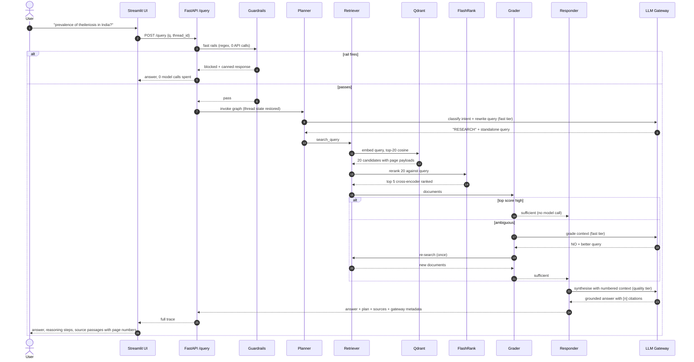
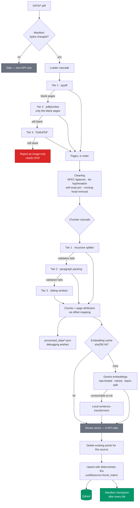
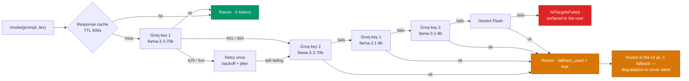
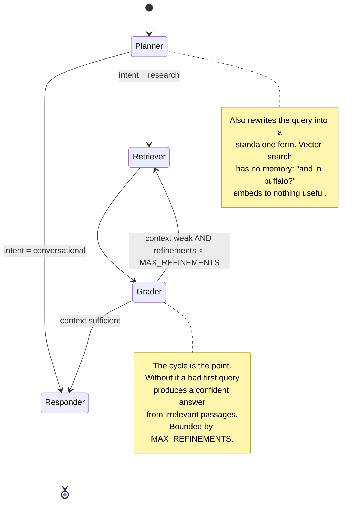
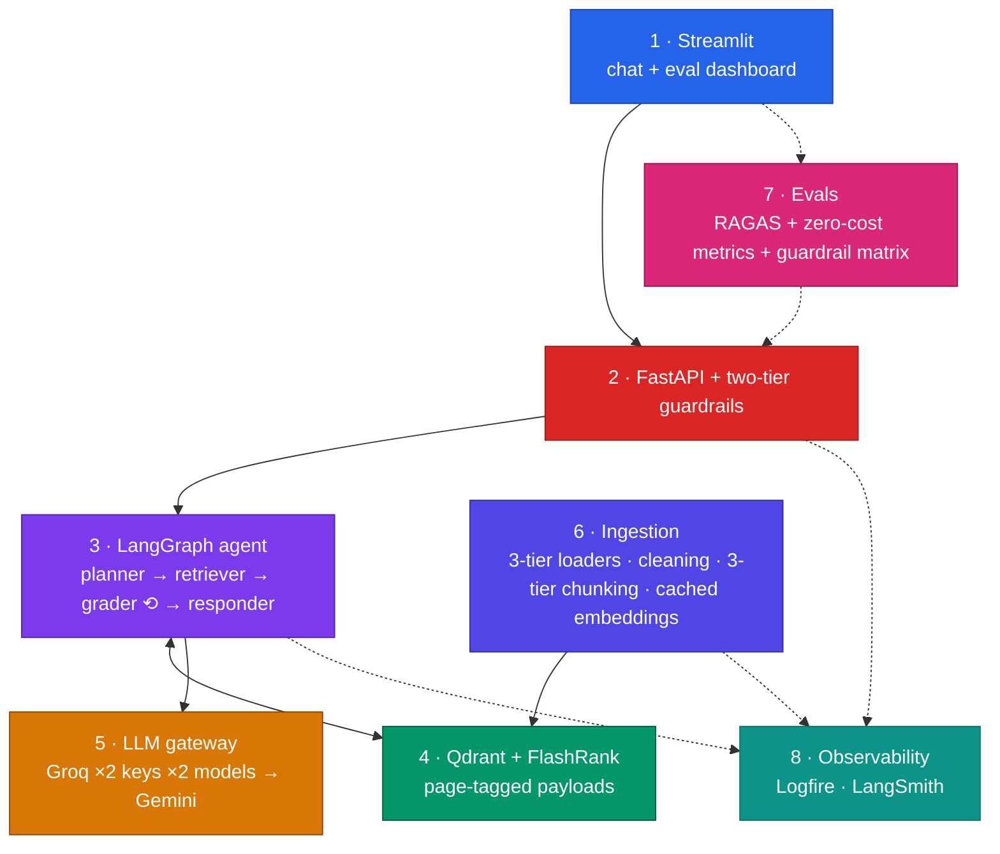

# Architecture

Three views of the same system, from most detailed to most compact.

---

## 1. Query path — what happens to a question

---

## 2. Ingestion path — what happens to a PDF

---

## 3. LLM gateway — the fallback ladder

The `fast` tier reverses the model order (8B first). Planner and grader calls run on every query
and do not need a 70B model — spending the good quota there is what exhausts it before the answer
is even generated.

---

## 4. Agent state machine

---

## 5. Compact view

---

## Design decisions worth defending

| Decision | Rationale |
|---|---|
| Vector dimension is **probed**, never hardcoded | Model availability differs per Google account and dimensions change between versions. A hardcoded 3072 is how a collection silently rejects every upsert. |
| Embedding backend is **locked after init** | Qdrant fixes the dimension at collection creation. Switching from 3072-dim Gemini to 768-dim local mid-run would corrupt the index, so a mid-run failure raises instead. |
| Deterministic point IDs + delete-before-upsert | Re-ingesting an edited document leaves no orphaned chunks from its longer previous version. |
| PDF fallbacks apply **per page** | A 124-page journal issue with four bad pages costs three page-opens, not a full re-parse — and recovered pages land back in position, so page citations stay correct. |
| Chunk strategies are **validated** before acceptance | A splitter that silently returns one 200 KB chunk embeds fine, retrieves for everything, and blows the context budget. Failing over is better than accepting it. |
| Guardrails are deterministic first | An LLM-based rail spends a model call on every greeting it exists to reject cheaply. On a free tier that is backwards. |
| Off-topic blocking requires **explicit** off-domain signals | "What did the study find?" contains no veterinary term but is a valid follow-up. False positives destroy trust faster than false negatives waste quota. |
| "No evidence" is answered **without an LLM** | A model asked to admit ignorance will sometimes answer from parametric memory instead — the exact failure a grounded system exists to prevent. |
| `plan` is not a LangGraph reducer | MemorySaver persists state per thread, so an accumulating plan would replay every previous turn's reasoning. Nodes concatenate explicitly and the planner resets it. |
| Evals hit the **live API**, not the graph | What gets measured is the system as deployed — guardrails, gateway fallback and the correction loop included. |
