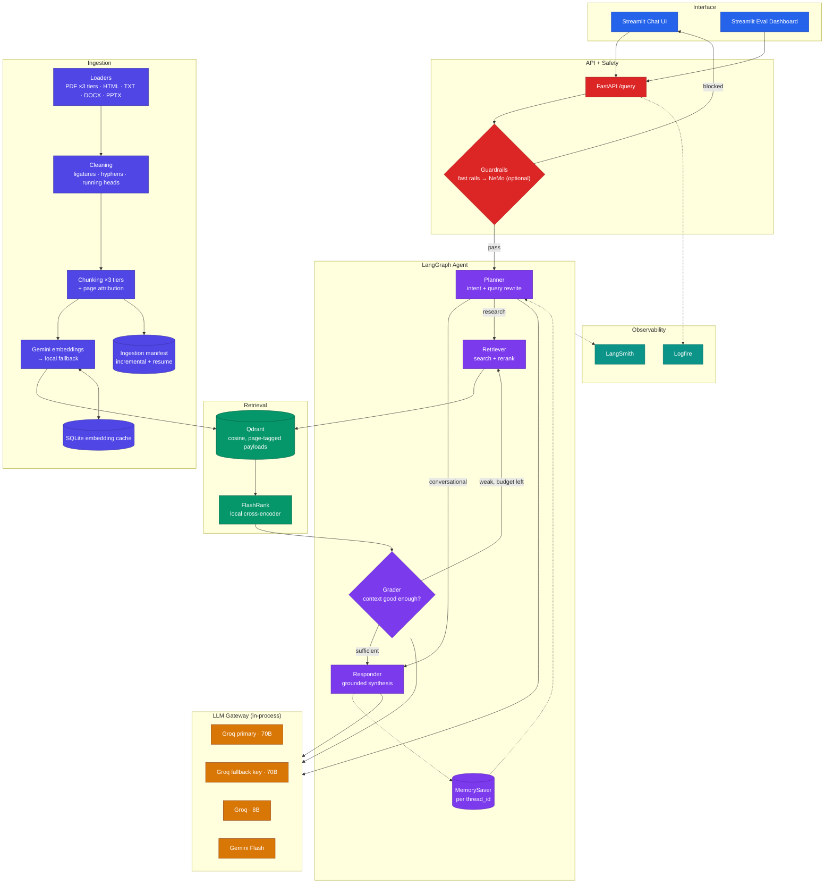

# Bovine Disease Research Assistant

An agentic RAG system over a corpus of peer-reviewed papers on **cattle and buffalo disease** —
haemoprotozoal infections (theileriosis, babesiosis, anaplasmosis), brucellosis, lumpy skin
disease, foot and eye disorders, genetic disorders, *E. coli*, and dairy-herd health management.

Built to run **entirely on free tiers**: Gemini for embeddings, Groq for reasoning (two keys
chained), Qdrant in Docker or on the free cloud plan, and local models for reranking. No paid
API is required at any point.

---

## What makes it more than a RAG demo

| Capability | Where |
|---|---|
| **Agentic self-correction** — the agent grades its own retrieved context and re-searches with a rewritten query when it is too weak | `app/agents/nodes/grader.py` |
| **Multi-key LLM gateway** — Groq primary → Groq fallback key → smaller model → Gemini, with retries, backoff and a response cache | `app/llm/router.py` |
| **Three-tier PDF extraction** — pypdf → pdfplumber → PyMuPDF, applied *per page* so a 124-page journal issue is not re-parsed for four bad pages | `app/ingestion/loaders/pdf.py` |
| **Three-tier chunking** — recursive → paragraph → sliding window, each validated before acceptance | `app/ingestion/chunking/splitter.py` |
| **Page-accurate citations** — every chunk carries its page range, so answers cite "paper.pdf, p. 4-5" | `app/ingestion/chunking/splitter.py` |
| **Academic text repair** — ligature folding, de-hyphenation, running-header removal | `app/ingestion/cleaning.py` |
| **Quota protection** — on-disk embedding cache, client-side rate limiter, incremental re-ingestion, adaptive batch splitting | `app/services/retrieval/embedding.py` |
| **Two-tier guardrails** — deterministic zero-cost rails, with optional NeMo Guardrails on top | `app/guardrails/` |
| **Full observability** — Logfire spans through every layer, plus LangSmith agent traces | `app/observability.py` |
| **Evaluation suite** — RAGAS metrics, zero-cost retrieval/tool metrics, and a guardrail confusion matrix | `evals/` |

---

## Architecture



Full diagrams: [ARCHITECTURE.md](ARCHITECTURE.md).

---

## Free-tier model strategy

**Groq has no embeddings endpoint** — it serves chat models only. So the two free ladders are
separate, and each is protected differently:

```
EMBEDDINGS   Gemini (free quota)  →  local sentence-transformers (offline, unlimited)
REASONING    Groq key 1 · 70B  →  Groq key 2 · 70B  →  Groq · 8B  →  Gemini Flash
```

Your `GROQ_FALLBACK_API_KEY` is a genuine second free quota on the reasoning side. On the
embedding side the safety net is a local model that needs no API at all.

Three further mechanisms keep the free Gemini quota from being the bottleneck:

- **Embedding cache** (`.cache/embeddings.sqlite3`) — re-indexing unchanged text costs zero calls.
- **Ingestion manifest** — unchanged files are skipped entirely; a crashed run resumes where it stopped.
- **Client-side rate limiter** — stays under the RPM ceiling instead of discovering it by failing.

---

## Setup

### 0. Prerequisites

- Python 3.10+
- Docker (only if running Qdrant locally)

### 1. Environment

```bash
cd /Users/lomashchoudhary/Developer/Projects/Final_Year_Rag_Project

python3 -m venv .venv
source .venv/bin/activate

pip install --upgrade pip
pip install -r requirements.txt
```

### 2. Configure keys

```bash
cp .env.example .env
```

Then edit `.env`. The minimum needed to run:

| Variable | Where to get it | Required |
|---|---|---|
| `GEMINI_API_KEY` | https://aistudio.google.com/apikey | yes — embeddings |
| `GROQ_API_KEY` | https://console.groq.com/keys | yes — reasoning |
| `GROQ_FALLBACK_API_KEY` | a second Groq account | recommended — doubles your quota |
| `QDRANT_CLUSTER_ENDPOINT` | `http://localhost:6333` for Docker, or https://cloud.qdrant.io | yes |
| `QDRANT_API_KEY` | Qdrant Cloud only — leave blank for local | no |
| `LOGFIRE_TOKEN` | https://logfire.pydantic.dev | no — falls back to console tracing |
| `LANGSMITH_API_KEY` | https://smith.langchain.com | no |
| `JUDGE_GROQ` | a third Groq key, used only by the eval judge | no |

> `PORTKEY_API_KEY` is **not needed**. This project ships its own gateway with the same
> fallback/retry/cache behaviour — see [DOCS/09_LLM_GATEWAY.md](DOCS/09_LLM_GATEWAY.md) for what
> Portkey is and when you would actually want it.

### 3. Start Qdrant

```bash
docker compose up -d
docker compose ps                       # confirm it is healthy
open http://localhost:6333/dashboard    # optional
```

Skip this step entirely if you are using Qdrant Cloud.

---

## Ingestion

### 4. Preflight (no API calls)

```bash
python -m scripts.doctor
```

Checks config, Qdrant connectivity, the corpus and every parser tier. Fix anything marked
`FAIL` before continuing.

To also verify your keys actually work (spends ~2 API calls):

```bash
python -m scripts.doctor --live
```

### 5. Dry run — parse and chunk only, zero quota spent

```bash
python -m app.ingestion.processor --dry-run
```

Exercises the whole loader and chunker cascade and writes the parsed output to
`processed_data/*.json`. **Read one of those files before ingesting for real** — it shows exactly
what text will be embedded, which is the fastest way to catch a badly-extracted PDF.

### 6. Ingest for real

```bash
python -m app.ingestion.processor --wipe
```

`--wipe` drops and recreates the Qdrant collection. Use it for the first run and whenever you
change `CHUNK_SIZE` or the embedding model.

Other modes:

```bash
python -m app.ingestion.processor                          # skip unchanged files (safe to re-run)
python -m app.ingestion.processor --force                  # re-ingest everything, keep the collection
python -m app.ingestion.processor --limit 2                # first 2 files only — good for a first test
python -m app.ingestion.processor --file "fnx050.pdf"      # a single document
python -m app.ingestion.processor DATA/subfolder           # a different directory
```

If a run dies partway (quota wall, network drop), just run the same command again — the manifest
makes it resume.

---

## Running the app

### 7. Backend

```bash
source .venv/bin/activate
uvicorn app.main:app --reload --port 8000
```

Check it: <http://localhost:8000/health> — it reports Qdrant point count, the active embedding
model, guardrail mode and gateway state. Interactive API docs at <http://localhost:8000/docs>.

### 8. Chat UI — in a second terminal

```bash
source .venv/bin/activate
streamlit run ui/app.py
```

Opens at <http://localhost:8501>.

### 9. Evaluation dashboard — in a third terminal (optional)

```bash
source .venv/bin/activate
streamlit run evals/app.py --server.port 8502
```

Opens at <http://localhost:8502>. Requires the backend to be running.

---

## Everything in order

```bash
# ── one-time setup ────────────────────────────────────────────────────────────
cd /Users/lomashchoudhary/Developer/Projects/Final_Year_Rag_Project
python3 -m venv .venv
source .venv/bin/activate
pip install --upgrade pip
pip install -r requirements.txt
cp .env.example .env          # then fill in your keys

# ── infrastructure ────────────────────────────────────────────────────────────
docker compose up -d

# ── verify, then ingest ───────────────────────────────────────────────────────
python -m scripts.doctor
python -m app.ingestion.processor --dry-run
python -m app.ingestion.processor --wipe

# ── run (three terminals, each with the venv activated) ───────────────────────
uvicorn app.main:app --reload --port 8000        # terminal 1
streamlit run ui/app.py                          # terminal 2
streamlit run evals/app.py --server.port 8502    # terminal 3 (optional)
```

There is a `Makefile` with the same steps as shortcuts — `make help` lists them.

---

## Evaluation

The dashboard has three tabs, or you can run each phase from the CLI:

```bash
python -m evals.pipeline           # phase 1 — replay the golden dataset against the live API
python -m evals.metrics            # phase 2 — score it (zero-cost metrics + RAGAS)
python -m evals.guardrails_eval    # guardrail confusion matrix
```

**Zero-cost metrics** (no LLM, run these freely):

- `tool_correctness` — did the agent choose the right path: retrieve, answer directly, or block?
- `retrieval_hit_rate` — did retrieval surface the paper the answer should have come from? This
  separates retrieval failures from generation failures.

**RAGAS metrics** (LLM-judged, uses `JUDGE_GROQ`): faithfulness, answer relevancy, context
precision, context recall, answer correctness. Expect 10-15 minutes — the runner deliberately
paces itself for Groq's free TPM limit.

The golden dataset (`evals/golden_dataset.json`) is 16 questions with reference answers quoted
from the actual papers, plus 10 guardrail test cases including near-miss legitimate questions
that must *not* be blocked.

---

## Project layout

```text
├── app/
│   ├── agents/
│   │   ├── graph.py            # LangGraph wiring, including the self-correction cycle
│   │   ├── state.py            # shared state + reducers
│   │   └── nodes/              # planner · retriever · grader · responder
│   ├── guardrails/
│   │   ├── fast_rails.py       # deterministic tier — zero API cost
│   │   ├── colang_rules.py     # NeMo Colang intents (optional tier)
│   │   └── rails.py            # tier orchestration + graceful degradation
│   ├── ingestion/
│   │   ├── processor.py        # CLI: load → clean → chunk → embed → index
│   │   ├── manifest.py         # incremental re-ingestion and resume
│   │   ├── cleaning.py         # academic PDF text repair
│   │   ├── chunking/           # three-tier chunker with page attribution
│   │   └── loaders/            # PDF (3 tiers) · HTML · TXT · DOCX · PPTX
│   ├── llm/router.py           # LLM gateway: fallback chain, retries, cache
│   ├── services/retrieval/     # embeddings · embedding cache · Qdrant · reranker
│   ├── config.py               # every tunable, with scope-aware validation
│   ├── observability.py        # Logfire + LangSmith bootstrap
│   └── main.py                 # FastAPI
├── evals/                      # golden dataset, RAGAS metrics, guardrail eval, dashboard
├── ui/app.py                   # Streamlit chat interface
├── scripts/doctor.py           # preflight check
├── DOCS/                       # deep-dive documentation
├── DATA/                       # the corpus (16 PDFs)
├── processed_data/             # generated — parsed and chunked JSON per document
└── docker-compose.yml          # local Qdrant
```

---

## Documentation

| # | Guide | Covers |
|---|---|---|
| 01 | [System Overview](DOCS/01_SYSTEM_OVERVIEW.md) | End-to-end request and ingestion flow |
| 02 | [Ingestion Engine](DOCS/02_INGESTION_ENGINE.md) | Loader and chunker cascades, cleaning, manifest |
| 03 | [Agent Nodes](DOCS/03_AGENT_NODES.md) | Planner, retriever, grader, responder internals |
| 04 | [Observability](DOCS/04_OBSERVABILITY.md) | Logfire and LangSmith tracing |
| 05 | [Environment Variables](DOCS/05_ENVIRONMENT_VARIABLES.md) | Every variable and how to tune it |
| 06 | [Known Gotchas](DOCS/06_KNOWN_GOTCHAS.md) | Non-obvious failures and why decisions were made |
| 07 | [Reranking](DOCS/07_RERANKING.md) | Bi-encoder vs cross-encoder, FlashRank |
| 08 | [Guardrails](DOCS/08_GUARDRAILS.md) | Two-tier design and how to extend it |
| 09 | [LLM Gateway](DOCS/09_LLM_GATEWAY.md) | What a gateway is, what Portkey does, why this is built in |
| 10 | [Evaluation](DOCS/10_EVALS.md) | Metric definitions and free-tier token budget |

---

## Troubleshooting

| Symptom | Fix |
|---|---|
| `Cannot reach Qdrant` | `docker compose up -d`, or check `QDRANT_CLUSTER_ENDPOINT` |
| `/health` shows 0 points | Ingestion has not run: `python -m app.ingestion.processor --wipe` |
| `DimensionMismatch` | The embedding model changed. Re-ingest with `--wipe` |
| `All LLM targets exhausted` | Every Groq key is rate-limited. Wait for the window, or add `GROQ_FALLBACK_API_KEY` |
| Ingestion stops on a 429 | Re-run the same command — the manifest resumes. Lower `EMBED_MAX_RPM` (counted in **texts**/min, free ceiling is 100) |
| `The write operation timed out` | Qdrant Cloud is throttling. Lower `QDRANT_UPSERT_BATCH` (default 24) or raise `QDRANT_TIMEOUT` |
| UI says "Backend unreachable. Tried " with a blank URL | `BACKEND_URL` is set but empty in `.env`. Remove the line or set `http://localhost:8000` |
| Answers cite the wrong page | Check `processed_data/<file>.json` — the PDF probably needs a different extractor tier |
| First query is very slow | FlashRank downloads its ONNX model once. Subsequent queries are fast |
| Legitimate question blocked | Add a domain term to `_DOMAIN_TERMS` in `app/guardrails/fast_rails.py` |
